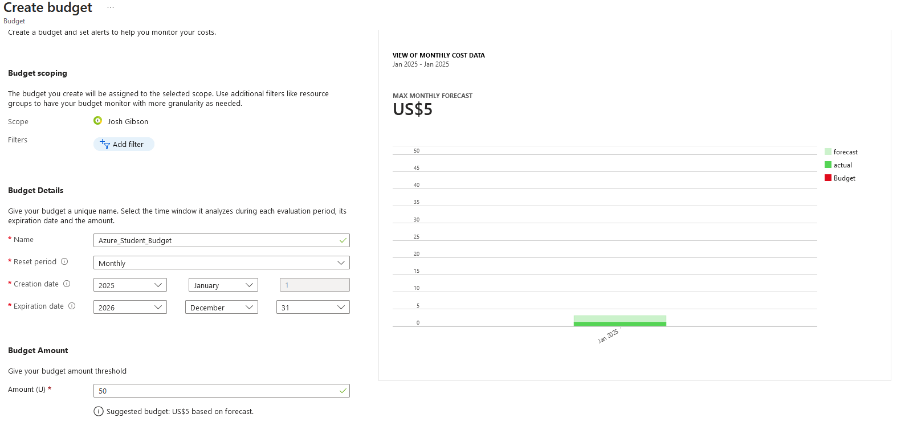

# Creating VMs in Azure 
In the following lab you will create, and use, a Virtual Machine using Microsoft's Azure Platform. 

<html lang="en">
<head>
    <meta charset="UTF-8">
    <meta name="viewport" content="width=device-width, initial-scale=1.0">
    <!-- Bootstrap CSS -->
    <link href="https://stackpath.bootstrapcdn.com/bootstrap/4.5.2/css/bootstrap.min.css" rel="stylesheet">
</head>
<body>
<div class="container mt-5">
    <div class="alert alert-info" role="alert">
    <svg xmlns="http://www.w3.org/2000/svg" width="16" height="16" fill="currentColor" class="bi bi-lightbulb" viewBox="0 0 16 16">
    <path d="M2 6a6 6 0 1 1 10.174 4.31c-.203.196-.359.4-.453.619l-.762 1.769A.5.5 0 0 1 10.5 13a.5.5 0 0 1 0 1 .5.5 0 0 1 0 1l-.224.447a1 1 0 0 1-.894.553H6.618a1 1 0 0 1-.894-.553L5.5 15a.5.5 0 0 1 0-1 .5.5 0 0 1 0-1 .5.5 0 0 1-.46-.302l-.761-1.77a2 2 0 0 0-.453-.618A5.98 5.98 0 0 1 2 6m6-5a5 5 0 0 0-3.479 8.592c.263.254.514.564.676.941L5.83 12h4.342l.632-1.467c.162-.377.413-.687.676-.941A5 5 0 0 0 8 1"/>
</svg> <strong>Tip!</strong>
        <p>Even though your assignment has not yet been released you should start preparing for it now to give yourself a chance at getting the highest marks possible. This lab has been designed in a way that anything marked with a <strong>"TIP"</strong> or <strong>"Important"</strong> tag will help you get more marks on your assignment, if you get in the habit of placing these suggested tasks in a Word document with clearly defined headings now it will make your assignment much easier (and possibly prevent you having to do this lab again!) If you are unsure how to screenshot, please ask!</p>
    </div>
</div>

<!-- Bootstrap JS and dependencies -->
<script src="https://code.jquery.com/jquery-3.5.1.slim.min.js"></script>
<script src="https://cdn.jsdelivr.net/npm/@popperjs/core@2.9.1/dist/umd/popper.min.js"></script>
<script src="https://stackpath.bootstrapcdn.com/bootstrap/4.5.2/js/bootstrap.min.js"></script>
</body>
</html>

## Logging Into Azure And Setting Up A Virtual Machine 

Before you can begin to create and use Virtual Machines you must first set up an Azure account and activate your free student subscription! 

Go to: https://azure.microsoft.com/en-gb/free/students and press the green "start free" button.  

When you have been redirected log in using your *University* account (It is essential you do this!). And follow the provided wizard to create an Azure student account.  

Once you have done this and have had your sign up confirmed, Log into the Azure Portal https://portal.azure.com and you should now be able to create a Virtual Machine  

Once you have logged in, from the main screen select the "Create A Resource" button to be redirected to the create a resource screen. 

 

Alternatively, you can select the portal menu on the left hand side of the screen and select create a resource. 

From the create a resource menu look (or search for!) Virtual Machines and press the "create" button. 

 

After clicking create you will be redirected to the Virtual Machine creation wizard. 

Enter the following information to create your VM.

- Subscription : Azure For Students 
- Resource Group : Create New resource group (click the blue "create new" link underneath the dropdown, and give it a name.) 
- Virtual Machine name: myVM 
- Region (US): East US 
- Availability Option: NO Infrastructure redundancy options required 
- Image: Windows Server 2019 Datacenter Gen2 
- Size: Standard_B1ms -1 vcpu, 2 GiB memory (If you don’t see the Size above, click “See all sizes” in the dropdown list to find the correct Size. 2GiB memory is minimum for our task) 
- Administrator account: Username: Create a user name 
<html lang="en">
<head>
    <meta charset="UTF-8">
    <meta name="viewport" content="width=device-width, initial-scale=1.0">
    <!-- Bootstrap CSS -->
    <link href="https://stackpath.bootstrapcdn.com/bootstrap/4.5.2/css/bootstrap.min.css" rel="stylesheet">
</head>
<body>
<div class="container mt-5">
    <div class="alert alert-danger" role="alert">
        <strong>Important!</strong>
        <p>Make sure you remember it! Do not leave it at the default, or make it something easy to guess, this could make your VM vulnerable</p>
    </div>
</div>

<!-- Bootstrap JS and dependencies -->
<script src="https://code.jquery.com/jquery-3.5.1.slim.min.js"></script>
<script src="https://cdn.jsdelivr.net/npm/@popperjs/core@2.9.1/dist/umd/popper.min.js"></script>
<script src="https://stackpath.bootstrapcdn.com/bootstrap/4.5.2/js/bootstrap.min.js"></script>
</body>
</html>
- Administrator account: Password: Create a strong password
<html lang="en">
<head>
    <meta charset="UTF-8">
    <meta name="viewport" content="width=device-width, initial-scale=1.0">
    <!-- Bootstrap CSS -->
    <link href="https://stackpath.bootstrapcdn.com/bootstrap/4.5.2/css/bootstrap.min.css" rel="stylesheet">
</head>
<body>
<div class="container mt-5">
    <div class="alert alert-danger" role="alert">
        <strong>Important!</strong>
        <p>And Remember this too!(Make sure your password is at least 12 characters long, has capital letters, numbers and symbols, this will again keep your VM safe.) </p>
    </div>
</div>

<!-- Bootstrap JS and dependencies -->
<script src="https://code.jquery.com/jquery-3.5.1.slim.min.js"></script>
<script src="https://cdn.jsdelivr.net/npm/@popperjs/core@2.9.1/dist/umd/popper.min.js"></script>
<script src="https://stackpath.bootstrapcdn.com/bootstrap/4.5.2/js/bootstrap.min.js"></script>
</body>
</html>
- Inbound port rules: Allow select ports 
- Select inbound ports: RDP(3389) and HTTP(80) 

When completed your VM creation form should look like it does below: 

 

When you have ensured that the information above matches your VM click "Review and Create" and then "Create" 

## Connecting to the Virtual Machine 

In this step you will connect to the VM, and use a few tools. 

When your VM has finished being generated: Use the Bell Icon then select go to resource, it should look similar to the screen below: 

 

The resource screen will give you an overview of the VM you just created. 

 

On your Windows Machine press Start and search for "Remote Desktop Connection" 

 

Open the program shown above, and you should see a screen like the one below 

 

Return to your opened Resource Window and take note of your "Public IP Address" You should then return to your "Remote Desktop Connection" window, enter it there and press connect. 

You will be asked to enter your Username and Password (The ones you created earlier when you made your VM), do this and press continue to get into your VM - you may get a window that asks for if you trust the certificate, you are fine to click yes here as you trust the machine you are connecting to - you created it! 

Once you have entered these details a new window will open and you should be redirected to a Windows Desktop, If this is the case you have successfully connected to your VM! 

<html lang="en">
<head>
    <meta charset="UTF-8">
    <meta name="viewport" content="width=device-width, initial-scale=1.0">
    <!-- Bootstrap CSS -->
    <link href="https://stackpath.bootstrapcdn.com/bootstrap/4.5.2/css/bootstrap.min.css" rel="stylesheet">
</head>
<body>
<div class="container mt-5">
    <div class="alert alert-info" role="alert">
    <svg xmlns="http://www.w3.org/2000/svg" width="16" height="16" fill="currentColor" class="bi bi-lightbulb" viewBox="0 0 16 16">
    <path d="M2 6a6 6 0 1 1 10.174 4.31c-.203.196-.359.4-.453.619l-.762 1.769A.5.5 0 0 1 10.5 13a.5.5 0 0 1 0 1 .5.5 0 0 1 0 1l-.224.447a1 1 0 0 1-.894.553H6.618a1 1 0 0 1-.894-.553L5.5 15a.5.5 0 0 1 0-1 .5.5 0 0 1 0-1 .5.5 0 0 1-.46-.302l-.761-1.77a2 2 0 0 0-.453-.618A5.98 5.98 0 0 1 2 6m6-5a5 5 0 0 0-3.479 8.592c.263.254.514.564.676.941L5.83 12h4.342l.632-1.467c.162-.377.413-.687.676-.941A5 5 0 0 0 8 1"/>
</svg> <strong>Tip!</strong>
        <p>You should add a screenshot of your newly opened VM to your portfolio, you should also include a couple of paragraphs on what you had to do to reach this point.</p>
    </div>
</div>

<!-- Bootstrap JS and dependencies -->
<script src="https://code.jquery.com/jquery-3.5.1.slim.min.js"></script>
<script src="https://cdn.jsdelivr.net/npm/@popperjs/core@2.9.1/dist/umd/popper.min.js"></script>
<script src="https://stackpath.bootstrapcdn.com/bootstrap/4.5.2/js/bootstrap.min.js"></script>
</body>
</html>

## Turning Your VM Into A Web Server 

Here you will install the Web Server role on the server on the Virtual Machine you just created and ensure the default IIS welcome page will be displayed: 

Inside of the VM, launch PowerShell as an administrator, by searching for it in the start menu and right clicking, then selecting the "run as administrator" option 

 

In PowerShell, Install the webserver feature on the VM by typing the following: Install-WindowsFeature -name Web-Server -IncludeManagementTools 

 

<html lang="en">
<head>
    <meta charset="UTF-8">
    <meta name="viewport" content="width=device-width, initial-scale=1.0">
    <!-- Bootstrap CSS -->
    <link href="https://stackpath.bootstrapcdn.com/bootstrap/4.5.2/css/bootstrap.min.css" rel="stylesheet">
</head>
<body>
<div class="container mt-5">
    <div class="alert alert-info" role="alert">
    <svg xmlns="http://www.w3.org/2000/svg" width="16" height="16" fill="currentColor" class="bi bi-lightbulb" viewBox="0 0 16 16">
    <path d="M2 6a6 6 0 1 1 10.174 4.31c-.203.196-.359.4-.453.619l-.762 1.769A.5.5 0 0 1 10.5 13a.5.5 0 0 1 0 1 .5.5 0 0 1 0 1l-.224.447a1 1 0 0 1-.894.553H6.618a1 1 0 0 1-.894-.553L5.5 15a.5.5 0 0 1 0-1 .5.5 0 0 1 0-1 .5.5 0 0 1-.46-.302l-.761-1.77a2 2 0 0 0-.453-.618A5.98 5.98 0 0 1 2 6m6-5a5 5 0 0 0-3.479 8.592c.263.254.514.564.676.941L5.83 12h4.342l.632-1.467c.162-.377.413-.687.676-.941A5 5 0 0 0 8 1"/>
</svg> <strong>Tip!</strong>
        <p>You should add a screenshot of this command in PowerShell to your portfolio, with a description of what you are doing.</p>
    </div>
</div>

<!-- Bootstrap JS and dependencies -->
<script src="https://code.jquery.com/jquery-3.5.1.slim.min.js"></script>
<script src="https://cdn.jsdelivr.net/npm/@popperjs/core@2.9.1/dist/umd/popper.min.js"></script>
<script src="https://stackpath.bootstrapcdn.com/bootstrap/4.5.2/js/bootstrap.min.js"></script>
</body>
</html>

Press enter, and note what is happening in your VM. 

Minimise your RDP connection and go back to the browser, enter the IP address of your cloud VM (the one you used to access the VM using RDP to begin with.) 

You should see the default Microsoft IIS Screen, which should look like the screen you see below. 

 

<html lang="en">
<head>
    <meta charset="UTF-8">
    <meta name="viewport" content="width=device-width, initial-scale=1.0">
    <!-- Bootstrap CSS -->
    <link href="https://stackpath.bootstrapcdn.com/bootstrap/4.5.2/css/bootstrap.min.css" rel="stylesheet">
</head>
<body>
<div class="container mt-5">
    <div class="alert alert-info" role="alert">
    <svg xmlns="http://www.w3.org/2000/svg" width="16" height="16" fill="currentColor" class="bi bi-lightbulb" viewBox="0 0 16 16">
    <path d="M2 6a6 6 0 1 1 10.174 4.31c-.203.196-.359.4-.453.619l-.762 1.769A.5.5 0 0 1 10.5 13a.5.5 0 0 1 0 1 .5.5 0 0 1 0 1l-.224.447a1 1 0 0 1-.894.553H6.618a1 1 0 0 1-.894-.553L5.5 15a.5.5 0 0 1 0-1 .5.5 0 0 1 0-1 .5.5 0 0 1-.46-.302l-.761-1.77a2 2 0 0 0-.453-.618A5.98 5.98 0 0 1 2 6m6-5a5 5 0 0 0-3.479 8.592c.263.254.514.564.676.941L5.83 12h4.342l.632-1.467c.162-.377.413-.687.676-.941A5 5 0 0 0 8 1"/>
</svg> <strong>Tip!</strong>
        <p>You should add a screenshot to your portfolio of this IIS splash screen open in the browser, with a full description of what you have done in this step.</p>
    </div>
</div>

<!-- Bootstrap JS and dependencies -->
<script src="https://code.jquery.com/jquery-3.5.1.slim.min.js"></script>
<script src="https://cdn.jsdelivr.net/npm/@popperjs/core@2.9.1/dist/umd/popper.min.js"></script>
<script src="https://stackpath.bootstrapcdn.com/bootstrap/4.5.2/js/bootstrap.min.js"></script>
</body>
</html>

## Adding Your Own Web Page To IIS 

Go back to your VM, and press the start button and look for the server manager.  

Once in the server manager search for Tools -> Internet Information Services (IIS) Manager 

In the window that opens, select "Default Website" and then "Advanced Settings" 

You should now be able to see a panel on the right hand side of the screen that gives you access to various aspects of the default website -but at this stage, we are only interested in "Physical Path" 

Note the location of this physical path. And open Windows explorer, you should be able to navigate to this location by placing it in the bar at the top of the screen. (it should be named wwwroot, and exist on the C Drive.) 

Highlight everything in the wwwroot folder, and move it to your VMs desktop (right click and press cut, then go back to your desktop right click and press paste.) This will help you revert to defaults if you run into any issues. 

Open a notepad document and write the word "hello".  

Save your document in your wwwroot folder and make sure you call it "default.html" this tells IIS what you want your default loaded webpage to be. 

<html lang="en">
<head>
    <meta charset="UTF-8">
    <meta name="viewport" content="width=device-width, initial-scale=1.0">
    <!-- Bootstrap CSS -->
    <link href="https://stackpath.bootstrapcdn.com/bootstrap/4.5.2/css/bootstrap.min.css" rel="stylesheet">
</head>
<body>
<div class="container mt-5">
    <div class="alert alert-info" role="alert">
    <svg xmlns="http://www.w3.org/2000/svg" width="16" height="16" fill="currentColor" class="bi bi-lightbulb" viewBox="0 0 16 16">
    <path d="M2 6a6 6 0 1 1 10.174 4.31c-.203.196-.359.4-.453.619l-.762 1.769A.5.5 0 0 1 10.5 13a.5.5 0 0 1 0 1 .5.5 0 0 1 0 1l-.224.447a1 1 0 0 1-.894.553H6.618a1 1 0 0 1-.894-.553L5.5 15a.5.5 0 0 1 0-1 .5.5 0 0 1 0-1 .5.5 0 0 1-.46-.302l-.761-1.77a2 2 0 0 0-.453-.618A5.98 5.98 0 0 1 2 6m6-5a5 5 0 0 0-3.479 8.592c.263.254.514.564.676.941L5.83 12h4.342l.632-1.467c.162-.377.413-.687.676-.941A5 5 0 0 0 8 1"/>
</svg> <strong>Tip!</strong>
        <p>You should add a screenshot of your wwwroot folder to your portfolio, with a full description of what you have done in this step. </p>
    </div>
</div>

<!-- Bootstrap JS and dependencies -->
<script src="https://code.jquery.com/jquery-3.5.1.slim.min.js"></script>
<script src="https://cdn.jsdelivr.net/npm/@popperjs/core@2.9.1/dist/umd/popper.min.js"></script>
<script src="https://stackpath.bootstrapcdn.com/bootstrap/4.5.2/js/bootstrap.min.js"></script>
</body>
</html>

Now go back to your Brower again, and refresh the page, you should see that the website you have created has changed.  

Go back to your notepad file and change the word "hello" to say "I am a created website" and save. 

Refresh your webpage and you should see that it has changed.  

<html lang="en">
<head>
    <meta charset="UTF-8">
    <meta name="viewport" content="width=device-width, initial-scale=1.0">
    <!-- Bootstrap CSS -->
    <link href="https://stackpath.bootstrapcdn.com/bootstrap/4.5.2/css/bootstrap.min.css" rel="stylesheet">
</head>
<body>
<div class="container mt-5">
    <div class="alert alert-info" role="alert">
    <svg xmlns="http://www.w3.org/2000/svg" width="16" height="16" fill="currentColor" class="bi bi-lightbulb" viewBox="0 0 16 16">
    <path d="M2 6a6 6 0 1 1 10.174 4.31c-.203.196-.359.4-.453.619l-.762 1.769A.5.5 0 0 1 10.5 13a.5.5 0 0 1 0 1 .5.5 0 0 1 0 1l-.224.447a1 1 0 0 1-.894.553H6.618a1 1 0 0 1-.894-.553L5.5 15a.5.5 0 0 1 0-1 .5.5 0 0 1 0-1 .5.5 0 0 1-.46-.302l-.761-1.77a2 2 0 0 0-.453-.618A5.98 5.98 0 0 1 2 6m6-5a5 5 0 0 0-3.479 8.592c.263.254.514.564.676.941L5.83 12h4.342l.632-1.467c.162-.377.413-.687.676-.941A5 5 0 0 0 8 1"/>
</svg> <strong>Tip!</strong>
        <p>You should add a screenshot of your changed website your portfolio, explaining what has happened. </p>
    </div>
</div>

<!-- Bootstrap JS and dependencies -->
<script src="https://code.jquery.com/jquery-3.5.1.slim.min.js"></script>
<script src="https://cdn.jsdelivr.net/npm/@popperjs/core@2.9.1/dist/umd/popper.min.js"></script>
<script src="https://stackpath.bootstrapcdn.com/bootstrap/4.5.2/js/bootstrap.min.js"></script>
</body>
</html>

Now, return to your notepad document and replace everything in it with this default HTML shell.  

```html
<!DOCTYPE html>
<html lang="en">
<head>
    <title>My First Azure Website</title>
</head>
<body>
    <h1>My name is: Insert name here</h1>
    <p>Anything You Want To Say About Yourself</p>
</body>
</html>
```

Save the file. Reload your web browser, you should be able to see a website rendered using HTML now

<html lang="en">
<head>
    <meta charset="UTF-8">
    <meta name="viewport" content="width=device-width, initial-scale=1.0">
    <!-- Bootstrap CSS -->
    <link href="https://stackpath.bootstrapcdn.com/bootstrap/4.5.2/css/bootstrap.min.css" rel="stylesheet">
</head>
<body>
<div class="container mt-5">
    <div class="alert alert-info" role="alert">
    <svg xmlns="http://www.w3.org/2000/svg" width="16" height="16" fill="currentColor" class="bi bi-lightbulb" viewBox="0 0 16 16">
    <path d="M2 6a6 6 0 1 1 10.174 4.31c-.203.196-.359.4-.453.619l-.762 1.769A.5.5 0 0 1 10.5 13a.5.5 0 0 1 0 1 .5.5 0 0 1 0 1l-.224.447a1 1 0 0 1-.894.553H6.618a1 1 0 0 1-.894-.553L5.5 15a.5.5 0 0 1 0-1 .5.5 0 0 1 0-1 .5.5 0 0 1-.46-.302l-.761-1.77a2 2 0 0 0-.453-.618A5.98 5.98 0 0 1 2 6m6-5a5 5 0 0 0-3.479 8.592c.263.254.514.564.676.941L5.83 12h4.342l.632-1.467c.162-.377.413-.687.676-.941A5 5 0 0 0 8 1"/>
</svg> <strong>Tip!</strong>
        <p>You should add a screenshot of your HTML loaded website here, explaining what you did. </p>
    </div>
</div>

<!-- Bootstrap JS and dependencies -->
<script src="https://code.jquery.com/jquery-3.5.1.slim.min.js"></script>
<script src="https://cdn.jsdelivr.net/npm/@popperjs/core@2.9.1/dist/umd/popper.min.js"></script>
<script src="https://stackpath.bootstrapcdn.com/bootstrap/4.5.2/js/bootstrap.min.js"></script>
</body>
</html>

Then 

<html lang="en">
<head>
    <meta charset="UTF-8">
    <meta name="viewport" content="width=device-width, initial-scale=1.0">
    <!-- Bootstrap CSS -->
    <link href="https://stackpath.bootstrapcdn.com/bootstrap/4.5.2/css/bootstrap.min.css" rel="stylesheet">
</head>
<body>
<div class="container mt-5">
    <div class="alert alert-warning" role="alert">
    <svg xmlns="http://www.w3.org/2000/svg" width="16" height="16" fill="currentColor" class="bi bi-exclamation-circle" viewBox="0 0 16 16">
        <path d="M8 15A7 7 0 1 1 8 1a7 7 0 0 1 0 14m0 1A8 8 0 1 0 8 0a8 8 0 0 0 0 16"/>
        <path d="M7.002 11a1 1 0 1 1 2 0 1 1 0 0 1-2 0M7.1 4.995a.905.905 0 1 1 1.8 0l-.35 3.507a.552.552 0 0 1-1.1 0z"/>
</svg> <strong>Important!</strong>
    <strong>Task:</strong>
        <p>Research how to use, bold, italics and underline in HTML, and edit your HTML document to include all three.</p>
    </div>
</div>

<!-- Bootstrap JS and dependencies -->
<script src="https://code.jquery.com/jquery-3.5.1.slim.min.js"></script>
<script src="https://cdn.jsdelivr.net/npm/@popperjs/core@2.9.1/dist/umd/popper.min.js"></script>
<script src="https://stackpath.bootstrapcdn.com/bootstrap/4.5.2/js/bootstrap.min.js"></script>
</body>
</html>

Then 

<html lang="en">
<head>
    <meta charset="UTF-8">
    <meta name="viewport" content="width=device-width, initial-scale=1.0">
    <!-- Bootstrap CSS -->
    <link href="https://stackpath.bootstrapcdn.com/bootstrap/4.5.2/css/bootstrap.min.css" rel="stylesheet">
</head>
<body>
<div class="container mt-5">
    <div class="alert alert-info" role="alert">
    <svg xmlns="http://www.w3.org/2000/svg" width="16" height="16" fill="currentColor" class="bi bi-lightbulb" viewBox="0 0 16 16">
    <path d="M2 6a6 6 0 1 1 10.174 4.31c-.203.196-.359.4-.453.619l-.762 1.769A.5.5 0 0 1 10.5 13a.5.5 0 0 1 0 1 .5.5 0 0 1 0 1l-.224.447a1 1 0 0 1-.894.553H6.618a1 1 0 0 1-.894-.553L5.5 15a.5.5 0 0 1 0-1 .5.5 0 0 1 0-1 .5.5 0 0 1-.46-.302l-.761-1.77a2 2 0 0 0-.453-.618A5.98 5.98 0 0 1 2 6m6-5a5 5 0 0 0-3.479 8.592c.263.254.514.564.676.941L5.83 12h4.342l.632-1.467c.162-.377.413-.687.676-.941A5 5 0 0 0 8 1"/>
</svg> <strong>Tip!</strong>
        <p>You should add a screenshot of your website running in the browser including these changes, explaining how you did it. </p>
    </div>
</div>

<!-- Bootstrap JS and dependencies -->
<script src="https://code.jquery.com/jquery-3.5.1.slim.min.js"></script>
<script src="https://cdn.jsdelivr.net/npm/@popperjs/core@2.9.1/dist/umd/popper.min.js"></script>
<script src="https://stackpath.bootstrapcdn.com/bootstrap/4.5.2/js/bootstrap.min.js"></script>
</body>
</html>

## Closing the VM and Cost Alerts 
From your VM information screen where you got the information about your VM previously, select the "Stop" and "Delete" options 

This will delete your VM and stop you from using your resources unnecessarily.  

<html lang="en">
<head>
    <meta charset="UTF-8">
    <meta name="viewport" content="width=device-width, initial-scale=1.0">
    <!-- Bootstrap CSS -->
    <link href="https://stackpath.bootstrapcdn.com/bootstrap/4.5.2/css/bootstrap.min.css" rel="stylesheet">
</head>
<body>
<div class="container mt-5">
    <div class="alert alert-info" role="alert">
    <svg xmlns="http://www.w3.org/2000/svg" width="16" height="16" fill="currentColor" class="bi bi-lightbulb" viewBox="0 0 16 16">
    <path d="M2 6a6 6 0 1 1 10.174 4.31c-.203.196-.359.4-.453.619l-.762 1.769A.5.5 0 0 1 10.5 13a.5.5 0 0 1 0 1 .5.5 0 0 1 0 1l-.224.447a1 1 0 0 1-.894.553H6.618a1 1 0 0 1-.894-.553L5.5 15a.5.5 0 0 1 0-1 .5.5 0 0 1 0-1 .5.5 0 0 1-.46-.302l-.761-1.77a2 2 0 0 0-.453-.618A5.98 5.98 0 0 1 2 6m6-5a5 5 0 0 0-3.479 8.592c.263.254.514.564.676.941L5.83 12h4.342l.632-1.467c.162-.377.413-.687.676-.941A5 5 0 0 0 8 1"/>
</svg> <strong>Tip!</strong>
        <p>You should add a screenshot of the VM page with the VM deleted, with an explanation as to why this is important. </p>
    </div>
</div>

<!-- Bootstrap JS and dependencies -->
<script src="https://code.jquery.com/jquery-3.5.1.slim.min.js"></script>
<script src="https://cdn.jsdelivr.net/npm/@popperjs/core@2.9.1/dist/umd/popper.min.js"></script>
<script src="https://stackpath.bootstrapcdn.com/bootstrap/4.5.2/js/bootstrap.min.js"></script>
</body>
</html>

Navigate to Home, then search for "Budgets" and enter the budgets tap, you should see something similar to below: 

 

Click the "Add" Button at the top of the screen. 

 
- Give your budget the name Azure_Student_Budget 
- Set the reset period to monthly 
- Keep the Creation and Expiration dates the same 
- Set the amount to $50 

When done it should look like the screenshot below: 

 

Click next at the bottom of the window to be moved onto the alerts section.
In the Alerts Section:
- Set your alert type to be "Actual" and "%" of budget to be 20.
- Set the Alert E-Mail to your own
- Set the language to one of your choice.

When all data is entered it should look like the image below.

 

You should keep an eye on this every time you log into the Azure service, and watch your e-mails for notifications that you may be approaching your budget!

<html lang="en">
<head>
    <meta charset="UTF-8">
    <meta name="viewport" content="width=device-width, initial-scale=1.0">
    <!-- Bootstrap CSS -->
    <link href="https://stackpath.bootstrapcdn.com/bootstrap/4.5.2/css/bootstrap.min.css" rel="stylesheet">
</head>
<body>
<div class="container mt-5">
    <div class="alert alert-info" role="alert">
    <svg xmlns="http://www.w3.org/2000/svg" width="16" height="16" fill="currentColor" class="bi bi-lightbulb" viewBox="0 0 16 16">
    <path d="M2 6a6 6 0 1 1 10.174 4.31c-.203.196-.359.4-.453.619l-.762 1.769A.5.5 0 0 1 10.5 13a.5.5 0 0 1 0 1 .5.5 0 0 1 0 1l-.224.447a1 1 0 0 1-.894.553H6.618a1 1 0 0 1-.894-.553L5.5 15a.5.5 0 0 1 0-1 .5.5 0 0 1 0-1 .5.5 0 0 1-.46-.302l-.761-1.77a2 2 0 0 0-.453-.618A5.98 5.98 0 0 1 2 6m6-5a5 5 0 0 0-3.479 8.592c.263.254.514.564.676.941L5.83 12h4.342l.632-1.467c.162-.377.413-.687.676-.941A5 5 0 0 0 8 1"/>
</svg> <strong>Tip!</strong>
        <p>You should add a screenshot of your created budget, and explain what you did.</p>
    </div>
</div>

<!-- Bootstrap JS and dependencies -->
<script src="https://code.jquery.com/jquery-3.5.1.slim.min.js"></script>
<script src="https://cdn.jsdelivr.net/npm/@popperjs/core@2.9.1/dist/umd/popper.min.js"></script>
<script src="https://stackpath.bootstrapcdn.com/bootstrap/4.5.2/js/bootstrap.min.js"></script>
</body>
</html>

Then

<html lang="en">
<head>
    <meta charset="UTF-8">
    <meta name="viewport" content="width=device-width, initial-scale=1.0">
    <!-- Bootstrap CSS -->
    <link href="https://stackpath.bootstrapcdn.com/bootstrap/4.5.2/css/bootstrap.min.css" rel="stylesheet">
</head>
<body>
<div class="container mt-5">
    <div class="alert alert-info" role="alert">
    <svg xmlns="http://www.w3.org/2000/svg" width="16" height="16" fill="currentColor" class="bi bi-lightbulb" viewBox="0 0 16 16">
    <path d="M2 6a6 6 0 1 1 10.174 4.31c-.203.196-.359.4-.453.619l-.762 1.769A.5.5 0 0 1 10.5 13a.5.5 0 0 1 0 1 .5.5 0 0 1 0 1l-.224.447a1 1 0 0 1-.894.553H6.618a1 1 0 0 1-.894-.553L5.5 15a.5.5 0 0 1 0-1 .5.5 0 0 1 0-1 .5.5 0 0 1-.46-.302l-.761-1.77a2 2 0 0 0-.453-.618A5.98 5.98 0 0 1 2 6m6-5a5 5 0 0 0-3.479 8.592c.263.254.514.564.676.941L5.83 12h4.342l.632-1.467c.162-.377.413-.687.676-.941A5 5 0 0 0 8 1"/>
</svg> <strong>Tip!</strong>
        <p>Add a final section to your report that includes a summary of what you did in this lab - what did you create? and did you manage to achieve everything first time, or did you run into any issues?</p>
    </div>
</div>

<!-- Bootstrap JS and dependencies -->
<script src="https://code.jquery.com/jquery-3.5.1.slim.min.js"></script>
<script src="https://cdn.jsdelivr.net/npm/@popperjs/core@2.9.1/dist/umd/popper.min.js"></script>
<script src="https://stackpath.bootstrapcdn.com/bootstrap/4.5.2/js/bootstrap.min.js"></script>
</body>
</html>

And that's it! You've completed lab one. 

 